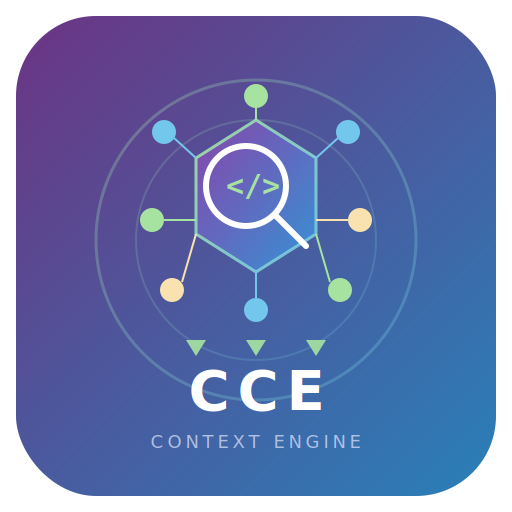

<p align="center">
  
</p>

<h1 align="center">Claude Context Engine</h1>

<p align="center">
  <strong>Index your codebase. Compress context. Cut token costs by 70%.</strong>
</p>

<p align="center">
  <a href="https://pypi.org/project/claude-context-engine/"></a>
  <a href="https://www.python.org/downloads/"></a>
  <a href="https://modelcontextprotocol.io"></a>
  <a href="https://opensource.org/licenses/MIT"></a>
  <a href="https://github.com/fazleelahhee/Claude-Context-Engine"></a>
  <a href="https://github.com/fazleelahhee/Claude-Context-Engine/issues"></a>
  <a href="https://github.com/fazleelahhee/Claude-Context-Engine/pulls"></a>
</p>

---

## Get Running in 60 Seconds

**Step 1 — Install**
```bash
brew tap fazleelahhee/tap && brew install claude-context-engine  # macOS
# or
pip install claude-context-engine                                 # all platforms
```

**Step 2 — Index your project**
```bash
cd /path/to/your/project
cce init
```

`cce init` handles everything: indexes your codebase, installs git hooks, and writes the MCP config to `.mcp.json` automatically.

**Step 3 — Restart Claude Code**

Done. Claude now searches your indexed codebase instead of re-reading files every session.

<p align="center">
  
</p>

---

## Why?

Every Claude Code session re-reads your files, re-discovers your architecture, and burns tokens on code it has seen before.

| | Without CCE | With CCE |
|---|---|---|
| Session startup | ~50k tokens | ~10k tokens |
| Finding a function | ~8k tokens | ~800 tokens |
| Cost per session (Opus 4) | ~$2.25 | ~$0.68 |
| Remembers past sessions | No | Yes |

**70% cost reduction. Zero cloud. Everything stays local.**

---

## What You Get

| Command | What It Does |
|---------|-------------|
| `cce init` | Index your project and connect to Claude Code (one-time) |
| `cce index` | Re-index (only changed files) |
| `cce status` | Show index stats |
| `cce serve` | Start MCP server for Claude Code |

Once connected, Claude Code gets these tools automatically:

| Tool | Description |
|------|-------------|
| `context_search` | Semantic search across your codebase |
| `expand_chunk` | Get the full source for a compressed chunk |
| `related_context` | Find related code via graph edges (graph traversal not yet wired — returns empty with an explanation) |
| `session_recall` | Recall past decisions and code-area notes recorded via `record_decision` / `record_code_area` |
| `record_decision` | Record a decision (with reason) for future recall |
| `record_code_area` | Record a code area worked on for future recall |
| `index_status` | Check when the index was last updated, plus token-savings stats |
| `reindex` | Trigger re-indexing of a file or full project (runs the real indexer synchronously) |
| `set_output_compression` | Adjust response verbosity (off/lite/standard/max). Persisted across restarts. |

---

<details>
<summary><h2>Configuration</h2></summary>

Works with zero config. Customize if you want:

**Global** (`~/.claude-context-engine/config.yaml`):
```yaml
compression:
  level: standard        # minimal | standard | full (input)
  output: standard       # off | lite | standard | max (output)
  model: phi3:mini       # Ollama model (auto-detected if running)

indexer:
  watch: true
  ignore: [.git, node_modules, __pycache__, .venv]

retrieval:
  top_k: 20
  confidence_threshold: 0.5
```

**Per-project** (`.context-engine.yaml` in project root):
```yaml
compression:
  level: full
indexer:
  ignore: [.git, node_modules, dist, coverage]
```

The engine auto-detects your machine resources:

| RAM | Profile | Behavior |
|-----|---------|----------|
| < 12 GB | light | Truncation only, small batches |
| 12-32 GB | standard | Full pipeline (default) |
| 32+ GB | full | Larger models, all features |

</details>

<details>
<summary><h2>Output Compression Levels</h2></summary>

Output tokens cost **5x more** than input. The engine includes built-in output compression:

| Level | Style | Savings |
|-------|-------|---------|
| **off** | Normal Claude | 0% |
| **lite** | No filler/hedging | ~30% |
| **standard** | Fragments, short words | ~65% |
| **max** | Telegraphic | ~75% |

Toggle mid-session:
```
"Switch to max output compression"
"Turn off output compression"
```

Code blocks, file paths, commands, and error messages are **never** compressed. Security warnings always use full clarity.

</details>

<details>
<summary><h2>How Token Compression Works</h2></summary>

### Layer 1: AST-Aware Chunking

Tree-sitter parses your code into semantic chunks — functions, classes, modules. No raw file reads.

```
Raw file (800 lines, ~12k tokens)
  → 15 function chunks + 3 class chunks
  → Only relevant chunks retrieved, not the whole file
```

### Layer 2: LLM Summarization (Ollama, auto-detected)

If Ollama is running locally, each chunk is summarized using type-specific prompts:

| Chunk Type | Example Output |
|-----------|----------------|
| Function/Class | `"process_payment(order, method): Validates payment, charges via Stripe, returns PaymentResult."` |
| Architecture | `"API gateway — routes HTTP to service handlers, applies auth + rate limiting."` |
| Decision | `"Chose PostgreSQL over MongoDB. Reason: relational queries for billing."` |

A quality checker ensures 40%+ of key identifiers survive compression.

### Layer 3: Smart Truncation (Default / Fallback)

Without Ollama: extracts function signatures and docstrings, drops bodies.

```python
# Original (45 lines, ~600 tokens)
def calculate_shipping(order, warehouse, method="standard"):
    """Calculate shipping cost based on order weight and location."""
    total_weight = sum(item.weight * item.quantity for item in order.items)
    # ... 40 more lines ...

# Compressed (2 lines, ~40 tokens)
def calculate_shipping(order, warehouse, method="standard"):
    """Calculate shipping cost based on order weight and location."""
```

Every chunk is scored: **50% vector similarity + 30% keyword / file-hint match + 20% recency.** Only chunks meeting the configured confidence threshold (`retrieval.confidence_threshold`, default 0.5) are returned.

### Progressive Disclosure

```
Session start:      Project overview               → 10k tokens
Search:             "Find payment processing"      → 800 tokens
Drill-down:         "Show full calculate_shipping" → 600 tokens
                                            Total: 11.4k tokens

Without engine:     Read payments.py + shipping.py → 45k tokens
```

</details>

<details>
<summary><h2>Token Savings: Detailed Breakdown</h2></summary>

### By Project Size

| | Without CCE | With CCE | Savings |
|---|---|---|---|
| **Small** (~50 files) | ~8k tokens startup | ~2k tokens | 75% |
| **Medium** (~500 files) | ~50k tokens startup | ~10k tokens | 80% |
| **Large** (~2000+ files) | ~100k+ tokens | ~10k tokens | 90%+ |

### Cost Comparison (Opus 4: $15/1M input, $75/1M output)

| Scenario | Input | Output | Total Cost | Savings |
|---|---|---|---|---|
| No tool | 50k | 20k | **$2.25** | |
| CCE (both compressions, default) | 10k | 7k | **$0.68** | **70%** |

</details>

<details>
<summary><h2>Optional: Ollama for Better Compression</h2></summary>

Without Ollama, the engine uses smart truncation (signatures + docstrings). With Ollama running, it auto-detects and uses LLM-quality summaries. No config needed.

```bash
brew install ollama
ollama pull phi3:mini
```

</details>

<details>
<summary><h2>Comparison: CCE vs Caveman</h2></summary>

[Caveman](https://github.com/JuliusBrussee/caveman) (36k+ stars) is a popular output-compression plugin.

| | CCE | Caveman |
|---|---|---|
| Compresses input tokens | Yes | No |
| Compresses output tokens | Yes | Yes (only focus) |
| Codebase indexing | Yes (AST + vector) | No |
| Session memory | Yes | No |
| Setup | `pip install` + `cce init` | Plugin install, zero config |
| Agent support | MCP-compatible agents | 40+ agents |

### Cost Comparison (Opus 4, medium project)

| Tool | Total Cost | Savings |
|---|---|---|
| No tool | $2.25 | |
| Caveman only | $1.28 | 43% |
| **CCE (default)** | **$0.68** | **70%** |

**Caveman** = makes Claude talk less. Zero setup.
**CCE** = makes Claude read less AND talk less. Deeper savings over time.

</details>

<details>
<summary><h2>Supported Languages</h2></summary>

**AST-aware chunking** (tree-sitter): Python, JavaScript, TypeScript, JSX, TSX

**Fallback chunking** (full-file): Markdown and other text files

Want more? See open issues for Go, Rust, and Java support.

</details>

---

## Contributing

We welcome contributions. See [CONTRIBUTING.md](CONTRIBUTING.md) for setup instructions.

> **Using CCE vs contributing to it**
>
> If you just want to use CCE in your projects, `pip install claude-context-engine` is all you need. No `uv`, no cloning, no virtualenv setup.
>
> `uv` and the dev dependencies only matter if you are working on CCE itself (running tests, modifying source code). Those steps are in CONTRIBUTING.md.

Check out the [good first issues](https://github.com/fazleelahhee/Claude-Context-Engine/issues?q=is%3Aissue+is%3Aopen+label%3A%22good+first+issue%22) to get started.

## Roadmap

- [ ] Tree-sitter support for Go, Rust, Java, C/C++
- [ ] Web dashboard for index inspection
- [ ] Persistent session search across projects
- [x] ~~PyPI package publishing~~
- [x] ~~GitHub Actions CI pipeline~~

## License

MIT. See [LICENSE](LICENSE).

## Acknowledgments

[Claude Code](https://docs.anthropic.com/en/docs/claude-code) | [MCP](https://modelcontextprotocol.io) | [LanceDB](https://lancedb.com/) | [Tree-sitter](https://tree-sitter.github.io/) | [Ollama](https://ollama.com/)

---

<p align="center">
  If this saves you tokens, give it a star — it helps others find it.
</p>
