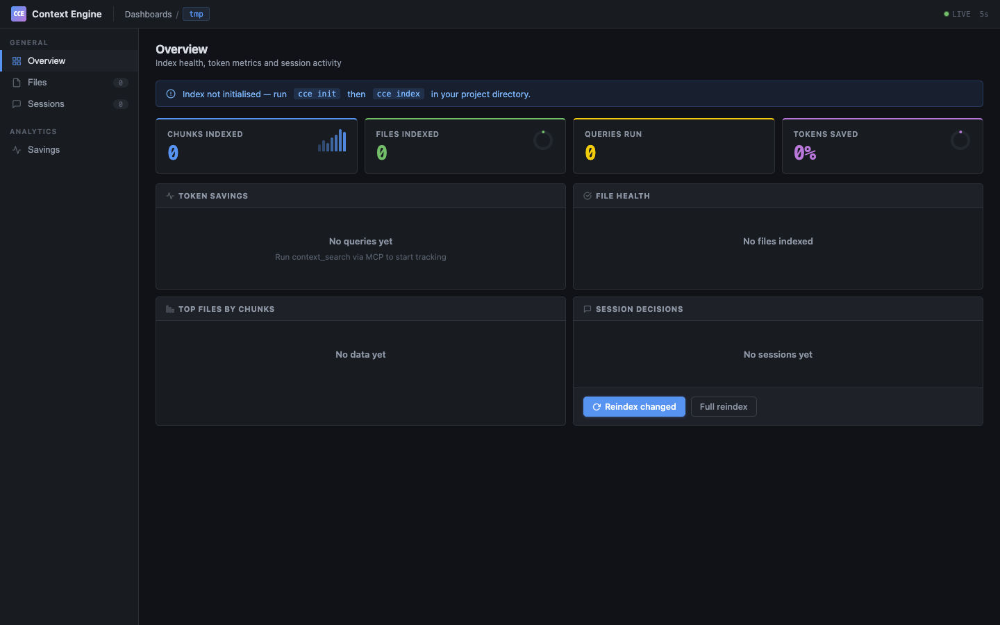

<p align="center">
  
</p>

<h1 align="center">Claude Context Engine</h1>

<p align="center">
  <strong>Give Claude exactly the context it needs. Nothing more.</strong>
</p>

<p align="center">
  <a href="https://pypi.org/project/claude-context-engine/"></a>
  <a href="https://www.python.org/downloads/"></a>
  <a href="https://modelcontextprotocol.io"></a>
  <a href="https://opensource.org/licenses/MIT"></a>
  <a href="https://github.com/fazleelahhee/Claude-Context-Engine"></a>
</p>

<p align="center">
  Claude Context Engine (CCE) is a local-first context engine for Claude Code. It indexes your repository, breaks code into meaningful chunks, and retrieves only the most relevant context for each task, so Claude spends fewer tokens re-reading code it has already seen.
</p>

---

## Overview

Every Claude Code session starts cold. Without CCE, you either paste too much context and burn tokens, or paste too little and get weak answers. CCE solves this by building a persistent, searchable index of your repository and feeding Claude only the chunks it actually needs.

| Problem | Without CCE | With CCE |
|---------|-------------|----------|
| Session startup | Claude re-reads files and project structure | Claude queries the index |
| Finding a function | Large prompt or manual file sharing | Targeted semantic retrieval |
| Token usage | High and repetitive | Focused and efficient |
| Cross-session memory | None by default | Decisions and code areas persisted |
| Repeated explanations | Re-explain the repo every session | Ask once, retrieve always |

---

## Quick Start

### 1. Install

```bash
brew tap fazleelahhee/tap && brew install claude-context-engine  # macOS (recommended)
# or
uv tool install claude-context-engine                             # all platforms (recommended)
# or
pipx install claude-context-engine                                # all platforms
# or
pip install claude-context-engine                                 # inside a virtualenv
```

### 2. Index your project

```bash
cd /path/to/your/project
cce init
```

`cce init` handles everything in one step: indexes your codebase, installs git hooks to keep the index current, and writes the MCP server entry to `.mcp.json`.

### 3. Restart Claude Code

Once restarted, Claude can call `context_search` to retrieve relevant code instead of reading files from scratch every session.

---

## Web Dashboard

CCE includes a local web dashboard for inspecting your index, viewing token savings, and managing indexed files.

```bash
cce dashboard
```

The dashboard opens automatically in your browser. Use `--no-browser` to suppress that behavior, or `--port` to specify a port.



The dashboard provides four views:

**Overview.** Four stat cards (chunks indexed, files indexed, queries run, tokens saved) plus a 2x2 chart grid: token savings donut, file health donut, top files by chunk count, and session decision activity. Live-updating every 5 seconds.

**Files.** Full list of indexed files with staleness detection. Files are marked `ok`, `stale` (modified since last index), or `missing` (deleted). Per-file reindex and removal available inline.

**Sessions.** Architectural decisions and code areas captured during Claude coding sessions, organized by session with expandable detail.

**Savings.** Token usage breakdown with a donut chart and stacked progress bar showing how many tokens CCE saved versus the raw file baseline. Output compression controls on the same page.

---

## Token Savings

Run `cce savings` for a quick terminal report:

```text
$ cce savings

     my-project · 38 queries
     14.2k / 48.0k tokens used (30%)

     Token savings
     With CCE:     14,200 tokens  (30%)
     Tokens saved: 33,800 tokens  (70%)
```

Savings grow over time. On the first query, CCE retrieves a small slice of your codebase. On subsequent queries, it retrieves different slices. The alternative is pasting entire files every time.

Exact savings depend on project size, query patterns, and compression settings.

---

## How It Works

### 1. Code Indexing

CCE walks your repository, hashes each file, and builds a LanceDB vector index. Git hooks keep the index current after each commit.

### 2. Semantic Chunking

Instead of treating files as flat text, CCE splits code into meaningful units: functions, classes, and modules. Each chunk is embedded independently.

```text
Raw file (800 lines, ~12k tokens)
  -> 15 function chunks + 3 class chunks
  -> Only relevant chunks retrieved, not the whole file
```

### 3. Compression

CCE can reduce context size in two ways. With Ollama running locally, it uses LLM-based summarization. Without Ollama, it falls back to smart truncation using function signatures and docstrings.

```python
# Original
def calculate_shipping(order, warehouse, method="standard"):
    """Calculate shipping cost based on order weight and location."""
    total_weight = sum(item.weight * item.quantity for item in order.items)
    # ... 40 more lines

# Compressed (truncation fallback)
def calculate_shipping(order, warehouse, method="standard"):
    """Calculate shipping cost based on order weight and location."""
```

### 4. Retrieval Ranking

Retrieved chunks are ranked by a combination of vector similarity, keyword match, and recency. Only chunks above the confidence threshold are returned.

### 5. Progressive Disclosure

CCE starts small and expands only when Claude needs more detail.

```text
Session start:      Project overview               ->  10k tokens
Search:             "Find payment processing"      ->   800 tokens
Drill-down:         "Show full calculate_shipping" ->   600 tokens
                                                    --------
                                                    11.4k tokens

Without CCE:        Read payments.py + shipping.py ->  45k tokens
```

---

## CLI Commands

| Command | Description |
|---------|-------------|
| `cce init` | One-time setup: index, git hooks, MCP config |
| `cce index` | Re-index changed files |
| `cce index --full` | Force a full re-index |
| `cce index --path <path>` | Index a specific file or directory |
| `cce status` | Show index config and token savings summary |
| `cce savings` | Visual token savings report |
| `cce savings --all` | Savings across all indexed projects |
| `cce savings --json` | Machine-readable savings output |
| `cce dashboard` | Open the web dashboard |
| `cce dashboard --port 8080` | Open on a specific port |
| `cce dashboard --no-browser` | Start server without opening a browser |
| `cce serve` | Start the MCP server (used by Claude Code) |

---

## MCP Tools

Once connected, Claude gets these tools automatically:

| Tool | Description |
|------|-------------|
| `context_search` | Semantic search across your indexed codebase |
| `expand_chunk` | Get full source for a compressed chunk |
| `session_recall` | Recall past decisions and code-area notes |
| `record_decision` | Save an architectural decision for future sessions |
| `record_code_area` | Record a file and a description of work done |
| `index_status` | Check index status and token savings stats |
| `reindex` | Trigger re-indexing of a file or the full project |
| `set_output_compression` | Adjust response verbosity: `off`, `lite`, `standard`, `max` |

---

## Output Compression

CCE includes built-in output compression to reduce the tokens Claude uses in its responses.

| Level | Style | Typical savings |
|-------|-------|-----------------|
| `off` | Full Claude output | 0% |
| `lite` | No filler or hedging | ~30% |
| `standard` | Shorter phrasing and fragments | ~65% |
| `max` | Telegraphic style | ~75% |

To change the level, tell Claude directly:

```text
Switch to max output compression
Turn off output compression
```

Code blocks, file paths, commands, and error messages are never compressed. Security warnings always use full verbosity.

---

## Configuration

CCE works with zero configuration. The following options are available when you need them.

### Global configuration

File: `~/.claude-context-engine/config.yaml`

```yaml
compression:
  level: standard        # minimal | standard | full (input compression)
  output: standard       # off | lite | standard | max (output compression)
  model: phi3:mini       # Ollama model (auto-detected if Ollama is running)

indexer:
  watch: true
  ignore: [.git, node_modules, __pycache__, .venv]

retrieval:
  top_k: 20
  confidence_threshold: 0.5
```

### Per-project configuration

File: `.context-engine.yaml` in your project root

```yaml
compression:
  level: full

indexer:
  ignore: [.git, node_modules, dist, coverage]
```

### Resource profiles

CCE auto-detects available memory and adjusts its behavior:

| RAM | Profile | Behavior |
|-----|---------|----------|
| Less than 12 GB | light | Truncation only, small batches |
| 12 to 32 GB | standard | Full pipeline |
| More than 32 GB | full | Larger models, all features enabled |

---

## Optional Ollama Support

Without Ollama, CCE uses smart truncation for compression. With Ollama running locally, it uses higher-quality LLM-based summaries automatically.

```bash
brew install ollama
ollama pull phi3:mini
ollama serve
```

No configuration required. CCE detects Ollama automatically.

---

## Supported Languages

### AST-aware chunking

| Language | Extension |
|----------|-----------|
| Python | `.py` |
| JavaScript | `.js` |
| TypeScript | `.ts` |
| JSX | `.jsx` |
| TSX | `.tsx` |
| PHP | `.php` |

### Fallback chunking

Markdown and other text-based files are supported with line-based chunking. Go, Rust, Java, C, and C++ are planned.

---

## Use Cases

- Onboarding to an unfamiliar codebase quickly
- Locating related logic scattered across multiple files
- Reducing prompt size for large repositories
- Maintaining architectural decisions across repeated sessions
- Improving first-pass answer quality from Claude Code

---

## Roadmap

- [x] Semantic code indexing and retrieval
- [x] Output compression levels
- [x] Cross-session memory (decisions, code areas)
- [x] Web dashboard with charts (`cce dashboard`)
- [x] Token savings tracking and reporting
- [ ] Tree-sitter support for Go, Rust, Java, C, and C++
- [ ] Persistent session search across projects
- [ ] Docker support for remote mode
- [ ] Retrieval quality benchmarks on real repositories

---

## Contributing

Contributions are welcome. See [CONTRIBUTING.md](CONTRIBUTING.md) for setup instructions.

To use CCE in your own projects, `pip install claude-context-engine` is all you need. Development dependencies only matter if you want to work on CCE itself.

Browse [good first issues](https://github.com/fazleelahhee/Claude-Context-Engine/issues?q=is%3Aissue+is%3Aopen+label%3A%22good+first+issue%22) if you are looking for a place to start.

---

## License

MIT. See [LICENSE](LICENSE).

## Acknowledgments

- [Claude Code](https://docs.anthropic.com/en/docs/claude-code)
- [MCP](https://modelcontextprotocol.io)
- [LanceDB](https://lancedb.com/)
- [Tree-sitter](https://tree-sitter.github.io/)
- [Ollama](https://ollama.com/)

If CCE saves you tokens, give it a star.
